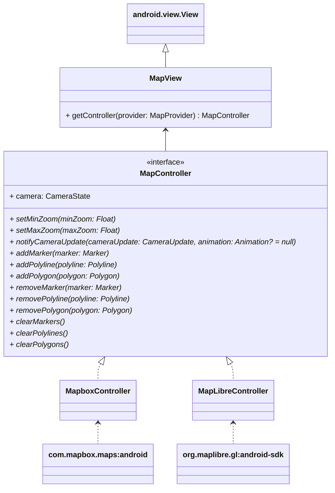
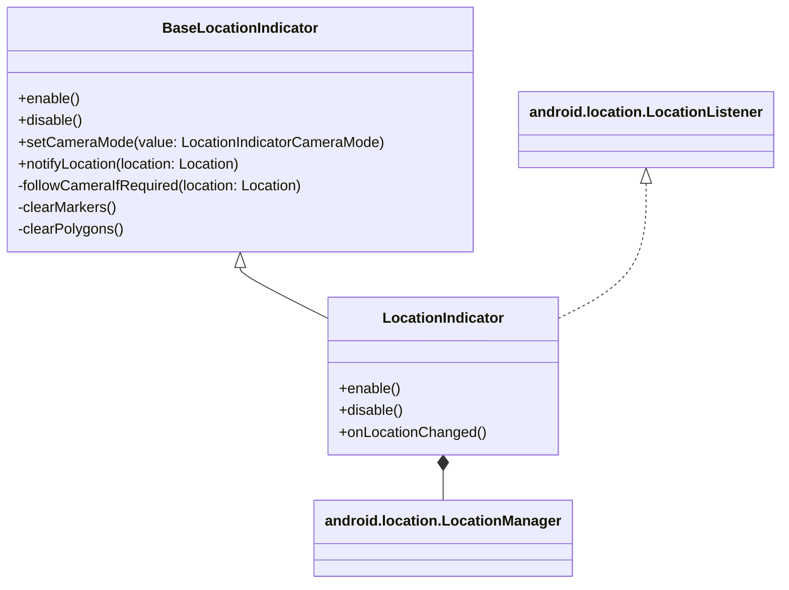

# enviroCar Map Module

The map module is used to visualize the track data & statistics, recorded by the enviroCar Android application on a map. The map module provides support for multiple map providers & libraries, which may be enabled or disabled during compilation.

The module has two important qualities:

- **Extensibility**: Multiple map providers will be supported & more can be easily added in the future.
- **Independence**: The map module may be utilized in other projects as well.

## Supported Providers

The module currently supports 2 map providers. These may be easily enabled or disabled during compile-time by adding or editing the `local.properties` file in the project as follows:

```properties
org.envirocar.map.enableMapbox=true
org.envirocar.map.enableMapLibre=true
```

By default, all available map providers are enabled. Additional configuration may be required for each map provider, which has been documented below.

### 1. Mapbox

`MapboxMapProvider` class provides support for the [Mapbox map provider](https://www.mapbox.com/).

A public token & private token from Mapbox is required to use this map provider. The steps are provided below:

1. Create an account [here](https://account.mapbox.com/auth/signup/).
2. Create a new token & provide it a "DOWNLOADS:READ" secret scope.
3. Specify the Mapbox public token as `mapbox_access_token` in the [`developer-config.xml` file](./org.envirocar.map/src/main/res/values/developer-config.xml).
4. Specify the Mapbox secret token as `MAPBOX_DOWNLOADS_TOKEN` in the [`gradle.properties` file](./gradle.properties).

### 2. MapLibre

`MapLibreMapProvider` class provides support for the [MapLibre map provider](https://maplibre.org/).

No changes required.

## Adding New Provider

All the providers supported by the module, sit inside the [`provider` directory](org.envirocar.map/src/main/java/org/envirocar/map/provider). A map provider must implement [`MapProvider`](./org.envirocar.map/src/main/java/org/envirocar/map/MapProvider.kt) & [`MapController`](./org.envirocar.map/src/main/java/org/envirocar/map/MapController.kt) interfaces. Existing implementations may be used as a reference.

## Architecture





## Usage

The map module is fairly easy to use. The minimal snippet below provides a better idea:


```xml
    <org.envirocar.map.MapView
            android:id="@+id/mapView"
            android:layout_width="match_parent"
            android:layout_height="match_parent" />
```

```kt
val view = findViewById<MapView>(R.id.mapView)
val provider = ... // May be [MapboxMapProvider] or [MapLibreMapProvider] etc.
val controller = view.getController(provider)

controller.addPolyline(
    Polyline.Builder(POINTS)
        .withWidth(4.0F)
        .withColor(0xFF0D53FF.toInt())
        .build()
)
controller.addMarker(Marker.Builder(POINTS.first()).build())
controller.addMarker(Marker.Builder(POINTS.last()).build())

controller.notifyCameraUpdate(
    CameraUpdateFactory.newCameraUpdateBasedOnBounds(
        POINTS,
        120.0F
    )
)
```

In essence, create a map view & initialize it with a map provider to access the map controller for manipulating the map e.g.
1. Creating a marker, polyline or polygon etc.
2. Manipulating the camera e.g. zoom, tilt or bearing etc.
3. Displaying user location.

